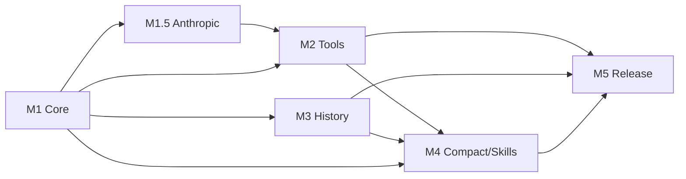

# Scorel Milestones

> Master roadmap from V0 through V1.x. Each V0 milestone has a detailed spec in `docs/V0-Mx.md`.

## Overview

```
V0 ──────────────────────────────────────────────────────────────────────
  M1 Core        M1.5 Anthropic     M2 Tools       M3 History
  ├── Message     ├── Anthropic       ├── Runner      ├── FTS5
  ├── EventStream │   adapter         ├── bash/r/w/e  ├── Export
  ├── OpenAI      ├── transform       ├── Approval    └── Archive
  └── Persistence │   Messages        └── Timeout
                  └── ID normalize
                                     M4 Compact      M5 Release
                                     ├── micro        ├── codesign
                                     ├── manual       ├── notarize
                                     └── Skills       └── Polish

Beta ────────────────────────────────────────────────────────────────────
  B1 auto_compact + subagent + TodoWrite
  B2 MCP integration
  B3 Embedding + vector search

V1 ──────────────────────────────────────────────────────────────────────
  Handoff + multi-provider routing

V1.x ────────────────────────────────────────────────────────────────────
  Plugin marketplace + team collaboration + cloud sync
```

---

## V0 Milestones

### M1: Core Loop
- **Spec**: [V0-M1.md](V0-M1.md)
- **Content**: Canonical message model + EventStream + OpenAI adapter + message persistence
- **Estimate**: 12–18 person-days
- **Go/No-Go**: Case A/B pass (OpenAI streaming + tool call parsing)
- **Dependencies**: None (foundation)

### M1.5: Anthropic Adapter
- **Spec**: [V0-M1.5.md](V0-M1.5.md)
- **Content**: Anthropic Messages adapter + transformMessages() + tool_call_id normalization
- **Estimate**: 8–12 person-days
- **Go/No-Go**: Case E/F/G/H pass (Anthropic streaming + tool round + ordering + ID normalization)
- **Dependencies**: M1

### M2: Tool Execution
- **Spec**: [V0-M2.md](V0-M2.md)
- **Content**: Runner (stdio JSONL) + bash/read/write/edit + approval state machine + Core-owned timeout
- **Estimate**: 15–22 person-days
- **Go/No-Go**: Tool round stable for both providers, abort/crash recovery works, Case J pass
- **Dependencies**: M1, M1.5

### M3: History & Search
- **Spec**: [V0-M3.md](V0-M3.md)
- **Content**: SQLite schema finalization + FTS5 + export JSONL/MD + archive/delete
- **Estimate**: 10–16 person-days
- **Go/No-Go**: Search < 200ms at 10k messages, export usable
- **Dependencies**: M1 (storage foundation)

### M4: Compact & Skills
- **Spec**: [V0-M4.md](V0-M4.md)
- **Content**: Three-layer compact (micro + manual + boundary resume) + load_skill (two-layer)
- **Estimate**: 12–18 person-days
- **Go/No-Go**: Case I pass, long session doesn't blow up, transcript recoverable
- **Dependencies**: M2 (tool results exist to compact), M3 (compactions table)

### M5: Release
- **Spec**: [V0-M5.md](V0-M5.md)
- **Content**: codesign + notarize + installer + first-run wizard + polish
- **Estimate**: 8–12 person-days
- **Go/No-Go**: Install/upgrade loop works on clean macOS
- **Dependencies**: M1–M4 complete

### V0 Total Estimate: 65–98 person-days

---

## V0 Dependency Graph



---

## Post-V0 Milestones

### Beta 1: Autonomy
- **Content**: auto_compact (token-threshold triggered), subagent tool (isolated child context), TodoWrite planning tool
- **Dependencies**: V0 stable, compact strategy proven
- **Key design**: subagent uses fresh `messages[]`, returns summary only to parent; aligns with learn-claude-code s04 pattern

### Beta 2: MCP Integration
- **Content**: MCP support (stdio + Streamable HTTP transports), tool discovery, dynamic tool registration
- **Dependencies**: Runner protocol extensible
- **Key design**: MCP servers as additional tool sources alongside built-in tools

### Beta 3: Semantic Search
- **Content**: Embedding pipeline, vector search, hybrid FTS + ANN retrieval
- **Dependencies**: Storage layer stable, embeddings table schema ready
- **Key design**: async embedding on message insert; search combines FTS keyword + ANN semantic results

### V1: Handoff & Routing
- **Content**: Handoff (spawn new thread from old context summary), multi-provider routing (auto-select provider/model per task)
- **Dependencies**: Compact + session model mature

### V1.x: Platform
- **Content**: Plugin/skill marketplace, team collaboration, cloud sync
- **Dependencies**: Security model hardened, trust/signing for skills

---

## Critical Test Cases (All Milestones)

| Case | Description | Milestone |
|------|------------|-----------|
| A | Streaming output + stop + send again (no tools) | M1 |
| B | Tool round: tool_calls → execute → re-request → final text | M1 (parse), M2 (execute) |
| C | pi #2007 pattern: assistant.content forced to string | M1 |
| D | Abort mid-stream → no orphan toolResult in next request | M2 |
| E | Anthropic text-only streaming turn | M1.5 |
| F | Anthropic tool round with tool_result in user message | M1.5 |
| G | transformMessages() ordering/extraction for Anthropic | M1.5 |
| H | Tool call ID normalization (>64 chars) | M1.5 |
| I | Manual compact boundary → resume → correct context | M4 |
| J | Deny tool call → error result → model adapts | M2 |

---

## Design Documents

| Document | Purpose |
|----------|---------|
| [V0_SPEC.md](V0_SPEC.md) | Master V0 specification (architecture, data model, storage, protocols) |
| [COMPAT.md](COMPAT.md) | Canonical model invariants, provider adapter mappings, pitfall registry |
| [CLAUDE.md](../CLAUDE.md) | Project conventions, structure, coding guidelines |
| [V0-M1.md](V0-M1.md) | M1: Core Loop milestone spec |
| [V0-M1.5.md](V0-M1.5.md) | M1.5: Anthropic Adapter milestone spec |
| [V0-M2.md](V0-M2.md) | M2: Tool Execution milestone spec |
| [V0-M3.md](V0-M3.md) | M3: History & Search milestone spec |
| [V0-M4.md](V0-M4.md) | M4: Compact & Skills milestone spec |
| [V0-M5.md](V0-M5.md) | M5: Release milestone spec |
