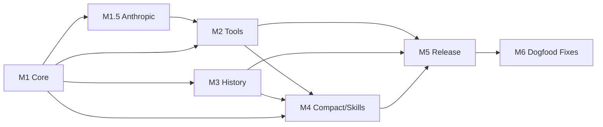

# Scorel Milestones

> Master roadmap from V0 through V3. Detailed stage docs live under `docs/roadmap/<version>/`.

## Overview

```
V0 ──────────────────────────────────────────────────────────────────────
  M1 Core        M1.5 Anthropic     M2 Tools       M3 History
  ├── Message     ├── Anthropic       ├── Runner      ├── FTS5
  ├── EventStream │   adapter         ├── bash/r/w/e  ├── Export
  ├── OpenAI      ├── transform       ├── Approval    └── Archive
  └── Persistence │   Messages        └── Timeout
                  └── ID normalize
                                     M4 Compact      M5 Release
                                     ├── micro        ├── codesign
                                     ├── manual       ├── notarize
                                     └── Skills       └── Polish

                                     M6 Dogfood Fixes
                                     ├── Approval UI
                                     ├── Markdown render
                                     ├── Settings panel
                                     └── Workspace UX

V1 ──────────────────────────────────────────────────────────────────────
  B1 auto_compact + subagent + TodoWrite + permission system
  B2 MCP integration
  B3 Embedding + vector search

V2 ──────────────────────────────────────────────────────────────────────
  Handoff + multi-provider routing

V3 ──────────────────────────────────────────────────────────────────────
  Plugin marketplace + team collaboration + cloud sync
```

---

## V0 Milestones

- **Index**: [v0/index.md](v0/index.md)

### M1: Core Loop
- **Spec**: [v0/m1-core-loop.md](v0/m1-core-loop.md)
- **Content**: Canonical message model + EventStream + OpenAI adapter + message persistence
- **Estimate**: 12–18 person-days
- **Go/No-Go**: Case A/B pass (OpenAI streaming + tool call parsing)
- **Dependencies**: None (foundation)

### M1.5: Anthropic Adapter
- **Spec**: [v0/m1.5-anthropic-adapter.md](v0/m1.5-anthropic-adapter.md)
- **Content**: Anthropic Messages adapter + transformMessages() + tool_call_id normalization
- **Estimate**: 8–12 person-days
- **Go/No-Go**: Case E/F/G/H pass (Anthropic streaming + tool round + ordering + ID normalization)
- **Dependencies**: M1

### M2: Tool Execution
- **Spec**: [v0/m2-tool-execution.md](v0/m2-tool-execution.md)
- **Content**: Runner (stdio JSONL) + bash/read/write/edit + approval state machine + Core-owned timeout
- **Estimate**: 15–22 person-days
- **Go/No-Go**: Tool round stable for both providers, abort/crash recovery works, Case J pass
- **Dependencies**: M1, M1.5

### M3: History & Search
- **Spec**: [v0/m3-history-search.md](v0/m3-history-search.md)
- **Content**: SQLite schema finalization + FTS5 + export JSONL/MD + archive/delete
- **Estimate**: 10–16 person-days
- **Go/No-Go**: Search < 200ms at 10k messages, export usable
- **Dependencies**: M1 (storage foundation)

### M4: Compact & Skills
- **Spec**: [v0/m4-compact-skills.md](v0/m4-compact-skills.md)
- **Content**: Three-layer compact (micro + manual + boundary resume) + load_skill (two-layer)
- **Estimate**: 12–18 person-days
- **Go/No-Go**: Case I pass, long session doesn't blow up, transcript recoverable
- **Dependencies**: M2 (tool results exist to compact), M3 (compactions table)

### M5: Release
- **Spec**: [v0/m5-release.md](v0/m5-release.md)
- **Content**: codesign + notarize + installer + first-run wizard + polish
- **Estimate**: 8–12 person-days
- **Go/No-Go**: Install/upgrade loop works on clean macOS
- **Dependencies**: M1–M4 complete

### M6: Dogfood Fixes
- **Spec**: [v0/m6-dogfood-fixes.md](v0/m6-dogfood-fixes.md)
- **Content**: Approval UI buttons + Markdown rendering + Settings panel + default workspace + workspace history
- **Estimate**: 8–12 person-days
- **Go/No-Go**: Full tool round works in UI (approve/deny visible), assistant output renders markdown, provider config editable post-setup, New Chat uses default workspace or picks from history
- **Dependencies**: M5
- **Origin**: First dogfood session findings ([../execution/dogfood/v0-manual.md](../execution/dogfood/v0-manual.md))

### V0 Total Estimate: 73–110 person-days

---

## V0 Dependency Graph



---

## Post-V0 Milestones

### V1: Autonomy & Expansion
- **Index**: [v1/index.md](v1/index.md)
- **Content**: B1 auto_compact (token-threshold triggered), subagent tool (isolated child context), TodoWrite planning tool, permission system (full access toggle + per-tool allow/confirm/deny + reject with reason); B2 MCP support (stdio + Streamable HTTP transports), tool discovery, dynamic tool registration; B3 embedding pipeline, vector search, hybrid FTS + ANN retrieval
- **Dependencies**: V0 stable (including M6), compact strategy proven, Runner protocol extensible, storage layer stable
- **Key design**: subagent uses fresh `messages[]`, returns summary only to parent; permission config stored in session/global settings with `full_access` override; MCP servers act as additional tool sources; semantic retrieval combines FTS keyword search with ANN results

### V2: Handoff & Routing
- **Index**: [v2/index.md](v2/index.md)
- **Content**: Handoff (spawn new thread from old context summary), multi-provider routing (auto-select provider/model per task)
- **Dependencies**: Compact + session model mature

### V3: Platform
- **Index**: [v3/index.md](v3/index.md)
- **Content**: Plugin/skill marketplace, team collaboration, cloud sync
- **Dependencies**: Security model hardened, trust/signing for skills

---

## Critical Test Cases (All Milestones)

| Case | Description | Milestone |
|------|------------|-----------|
| A | Streaming output + stop + send again (no tools) | M1 |
| B | Tool round: tool_calls → execute → re-request → final text | M1 (parse), M2 (execute) |
| C | pi #2007 pattern: assistant.content forced to string | M1 |
| D | Abort mid-stream → no orphan toolResult in next request | M2 |
| E | Anthropic text-only streaming turn | M1.5 |
| F | Anthropic tool round with tool_result in user message | M1.5 |
| G | transformMessages() ordering/extraction for Anthropic | M1.5 |
| H | Tool call ID normalization (>64 chars) | M1.5 |
| I | Manual compact boundary → resume → correct context | M4 |
| J | Deny tool call → error result → model adapts | M2 |
| K | Approve tool call via UI button → tool executes → result shown | M6 |
| L | Markdown code block + inline code + list renders correctly | M6 |
| M | Change provider API key in Settings → next request uses new key | M6 |
| N | New Chat uses default workspace without folder picker | M6 |

---

## Design Documents

| Document | Purpose |
|----------|---------|
| [../architecture/v0-spec.md](../architecture/v0-spec.md) | Master V0 specification (architecture, data model, storage, protocols) |
| [../architecture/compat.md](../architecture/compat.md) | Canonical model invariants, provider adapter mappings, pitfall registry |
| [CLAUDE.md](../../CLAUDE.md) | Project conventions, structure, coding guidelines |
| [v0/index.md](v0/index.md) | V0 stage index and milestone map |
| [v0/m1-core-loop.md](v0/m1-core-loop.md) | M1: Core Loop milestone spec |
| [v0/m1.5-anthropic-adapter.md](v0/m1.5-anthropic-adapter.md) | M1.5: Anthropic Adapter milestone spec |
| [v0/m2-tool-execution.md](v0/m2-tool-execution.md) | M2: Tool Execution milestone spec |
| [v0/m3-history-search.md](v0/m3-history-search.md) | M3: History & Search milestone spec |
| [v0/m4-compact-skills.md](v0/m4-compact-skills.md) | M4: Compact & Skills milestone spec |
| [v0/m5-release.md](v0/m5-release.md) | M5: Release milestone spec |
| [v0/m6-dogfood-fixes.md](v0/m6-dogfood-fixes.md) | M6: Dogfood Fixes milestone spec |
| [v1/index.md](v1/index.md) | V1 stage index and milestone map |
| [v2/index.md](v2/index.md) | V2 stage index and milestone map |
| [v3/index.md](v3/index.md) | V3 stage index and milestone map |
| [../execution/dogfood/v0-manual.md](../execution/dogfood/v0-manual.md) | V0 first dogfood session findings |
