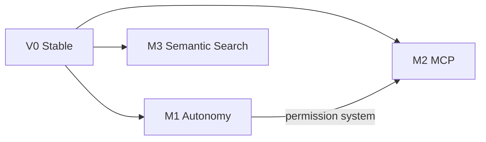

# V1 Index

> Autonomy and expansion after V0 stability.

## Goal

Expand Scorel from a usable desktop agent into a stronger work system with autonomy primitives, external tool ecosystem support, and semantic context retrieval. After V1, Scorel can manage long sessions autonomously, connect to MCP tool servers, and find prior work by meaning.

## Milestones

- [M1 Autonomy Foundation](m1-autonomy-foundation.md) — auto_compact, subagent, TodoWrite, permission system
- [M2 MCP Integration](m2-mcp-integration.md) — stdio + Streamable HTTP, tool discovery, dynamic registration
- [M3 Semantic Search](m3-semantic-search.md) — embedding pipeline, vector search, hybrid FTS + ANN ranking

## Dependencies

- V0 stable in real usage (including M6 dogfood fixes)
- Compact behavior proven in practice
- Storage and runner contracts stable enough to extend
- Permission and approval flow mature enough to generalize

## Dependency Graph

## Supporting Documents

- [V0 Spec](../../architecture/v0-spec.md) — base architecture that V1 extends
- [Compat Strategy](../../architecture/compat.md) — canonical model invariants
- [Milestones](../milestones.md) — master roadmap

## Exit Criteria

- A user can run long multi-step tasks without manually compacting, delegate subtasks via subagent, track progress with todos, connect MCP servers for external tools, and search prior conversations by meaning — all without workarounds.
